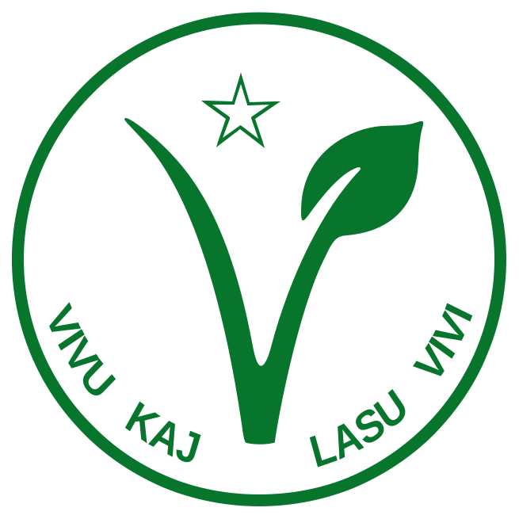

# Esperanto kaj vegetarismo  <!-- .element: id="presentation-title" -->

## Favoro de Zamenhof

### Verkoj:
* La rakonto «La hejmo de la metiisto»
* La artikolo «Kio estas vegetarismo?»

Notes:
Unue, eblas diri pri favora rilato al vegetarismo de Zamenhofo mem.

Ĉar jam en la jaro 1893 (nur 6 jarojn post la unua libro) en la revuo «La Esperantisto» aperis du favoraj verkoj pri vegetarismo.

La rakonto traktas vegetarismon de sana vidpunkto, la artikolo ĉefe de morala. 

Poste Zamenhof prenis tiujn du verkojn por la Fundamenta Krestomatio.

## Organizaĵoj

### Internacia Unuiĝo de Esperantistaj Vegetaranoj

4-a Universala Kongreso (UK) en Dresdeno

Notes: Dum la 4-a Universala Kongreso (UK) en Dresdeno, en 1908, fondiĝis Internacia Unuiĝo de Esperantistaj Vegetaranoj.
(la 16-a de aŭgusto 1908)

Laŭ «Esperantista Vegetarano» 1995, p. 23, ankaŭ «Ludoviko Zamenhof estis inter la membroj fondantoj»,
sed deziris, ke oni ne menciu tion en la vegetarana literaturo. Ne estas klare, ĉu tiu ĉi informo estas vera.

Interese, ke ankaŭ samspeca neesperantista organizaĵo Internacia Vegetarana Unuiĝo (IVU) fondiĝis du tagojn poste
en la sama loko, en Dresdeno (la 18-an de aŭgusto 1908).

La du kongresoj koincidis, ĉar oni proponis al neesperantistaj vegetaranoj organizi sian fondan
kongreson lige kun la UK, por ke esperantistoj povu ĉeesti ambaŭ aranĝojn kaj helpi la
internacian kompreniĝon en la IVU-kongreso pere de Esperanto.

Tamen evidentiĝis fine, ke nur malmultaj esperantistoj
emis ĉeesti ankaŭ la neesperantistan aranĝon.

Tamen, iu interago inter du organizaĵoj estis. En la 4-a Kongreso de IVU en 1913 en Hago,
Esperanto estis unu el la 5 oficialaj lingvoj.

Estis du paroladoj en Esperanto de S-ro J. A. Gill (Tunbridge) pri «La du verdaj aferoj» (spinacaj kaj Esperanto!)
kaj de S-ino van der Vet-Dirksen pri «Kio devas aparteni al la tuta homaro.» 

### Vegetara Ligo Esperantista (VLE)

Notes: Kelkajn jarojn poste tiu organizaĵo ŝanĝis sian nomon al Vegetara Ligo Esperantista (VLE).

Laŭ informo el Enciklopedio de Esperanto, la fama rusa vegetarano Lev Nikolaeviĉ Tolstoj, per speciala skriba konfirmo, akceptis ĝian honoran prezidantecon.

Notes:

La ligo eldonis flugfoliojn en Esperanto pri vegetarismo kaj en naciaj lingvoj pri Esperanto.

En julio 1914 komenciĝis eldonado de dumonata bulteno «Vegetarano».
La redaktoro estis Oskar Buneman.

La bulteno devis servi kiel ligilo inter la membroj kaj propagandilo inter
esperantistoj por vegetarismo, kaj inter vegetaranoj por Esperanto.

Tio ĉi estas la unua paĝo de la unua numero de ĝi.

Fine de 1916 pro malfacilaĵoj, kaŭzitaj de la Unua mondmilito, la eldono de la bulteno ĉesis.

La paŭzo daŭris kelkajn jarojn ĝis 1920, kiam okazis faka kunveno dum UK en Haago, kaj oni decidis revivigi la bultenon.
La redaktoro restis la sama. La enhavo rilatas ne nur al vegetarismo, sed al la tuta vivreformo kaj al la radikala pacifismo.

De 1927 ĝis 1932 la bulteno estis samtempe oficiala organo de IVU.
Kaj tiutempe en ĝi oni publikigis materialojn ne nur en Esperanto, sed ankaŭ en la angla, franca kaj germana.

En 1932 IVU ĉesigis la eldonon pro financaj kialoj.

### Tutmonda Esperantista Vegetarana Asocio (TEVA)

Ekde 1954

Fondinto: Natan Ben-Cion Ĥavkin

Notes:

Poste okazis la Dua mondmilito, dum kiu funkciis nenio.
Kaj jam post ĝi, en la jaro 1954, oni reorganizis la organizaĵon sub la nomo Tutmonda Esperantista Vegetarana Asocio (TEVA).

La reorganizinto estis Natan Ben-Cion Ĥavkin.
Li estis israela esperantisto, kiu devenis el Rusio, en Rusio lernis Esperanton kaj ĉirkaŭ la 20-a jaro
translokiĝis al Palestino. Kaj interalie oni opinias tiun homon ankaŭ unu el fondintoj de E-movado en Palestino.  

### TEVA hodiaŭ

* Paĝaro: [https://vegetarismo.info/](https://vegetarismo.info/).
* Bulteno «Esperantista Vegetarano» — aperas dufoje jare.
* TEVA membras en IVU kaj estas faka asocio, kunlaboranta kun UEA.
* Kunvenoj dum UK. Aparta aranĝo mankas.  
* Partopreno en neesperantaj E-aranĝoj.

### Vegetara Sekcio de SAT

Ekde 2012 (rekreiĝo)

* Paĝo: [http://satesperanto.org/spip.php?rubrique310](http://satesperanto.org/spip.php?rubrique310)
* Dissendolisto: [http://groups.google.com/group/sat-vegetara-sekcio](http://groups.google.com/group/sat-vegetara-sekcio)

Notes:
Ekde de komenco de 2012 reekis en SAT la vegetara frakcio, kiu agadas sub formo de frakcio.
Ekde tiam en ĉiuj kongresoj okazas kunsidoj de la vegetara frakcio kaj prelagoj pri la temo.

### Dankon pro la atento!
